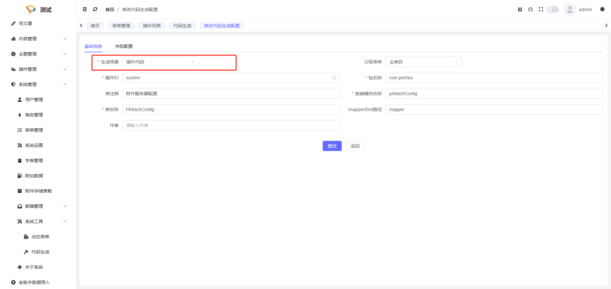

## 简介
为了杜绝繁琐的curd,我们提供了代码生成功能, 您可以在系统管理-> 系统工具 -> 代码生成中使用

## 导入表
您需要先创建数据库表, 之后点击导入表, 选择需要生成代码的表

## 配置
导入表之后, 点击配置,将生成场景选择为插件代码以及修改插件ID,包名称等信息

之后点击提交

## 下载
配置完毕后, 您可以点击下载, 将生成的代码下载到本地, 之后将下载的代码解压并复制进插件程序对应目录即可
