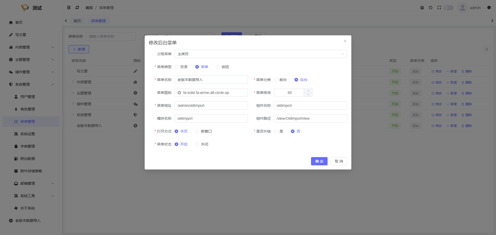

## 简介
插件前端,包括系统的前端都采用了模块化开发, 所以在创建菜单时有模块的概念, 以下内容会详细讲解这方面的逻辑及如何创建页面

## 创建菜单
在系统管理-> 菜单管理中新建菜单如下

其中菜单地址为url地址, 组件名称为页面的名称, 模块名称为模块名称(这个后边会讲), 组件路径为页面的具体路径(相对于模块目录)

> 注意: 在界面创建的菜单是没有pluginId的, 需要在创建完菜单后手动修改数据库,将插件ID填写至pluginId字段内, 一般这部分(包含创建菜单sql语句)应该提取为单独的sql语句, 存放至插件的安装sql文件内

## 创建模块及页面
在创建菜单时,我们填写的模块名称为oldImport, 那么我们就需要在前端的modules目录下新建oldImport目录,您可以将创建插件时生成的example模块复制一份该名称为oldImport, 目录结构如下
```bash
oldImport # oldImport模块
├── api # 接口相关(与后端交互的接口都在这里)
|   └── example.js # 接口api文件
├── view # 页面视图
|   └── ExampleView.vue # 页面
├── index.js # 模块入口
```
在创建菜单时,我们填写的组件路径为/view/OldImportView, 那么访问的时候就会查找当前模块下/view/OldImportView.vue文件, 我们将ExampleView.vue修改为OldImportView.vue, 这是目录结构如下
```bash
oldImport # oldImport模块
├── api # 接口相关(与后端交互的接口都在这里)
|   └── example.js # 接口api文件
├── view # 页面视图
|   └── OldImportView.vue # 页面
├── index.js # 模块入口
```
到这里,一个新的模块和页面就创建完毕了, 您可以启动插件前端,然后在主程序中进行访问了