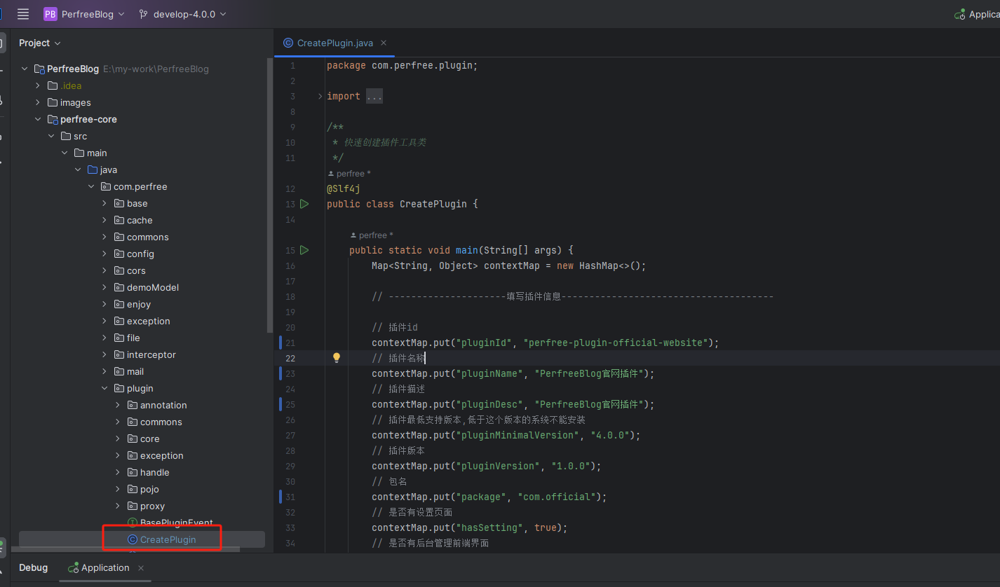
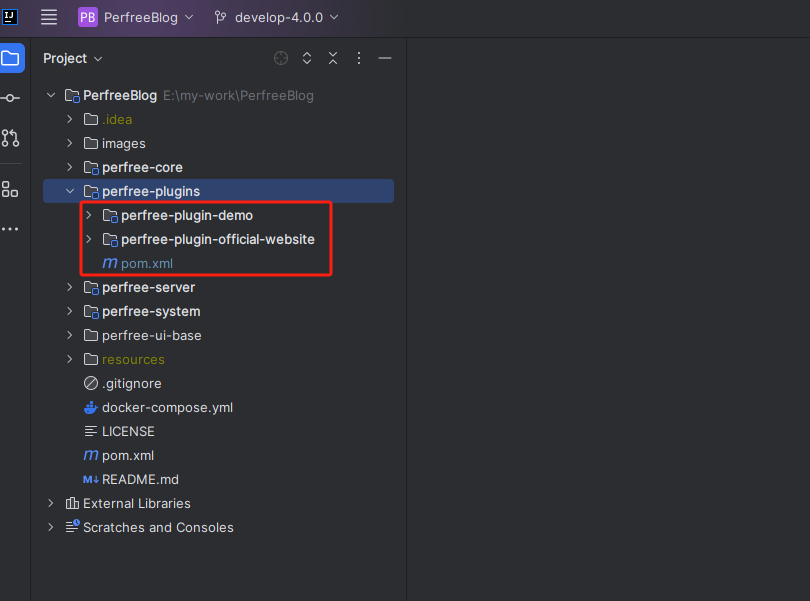
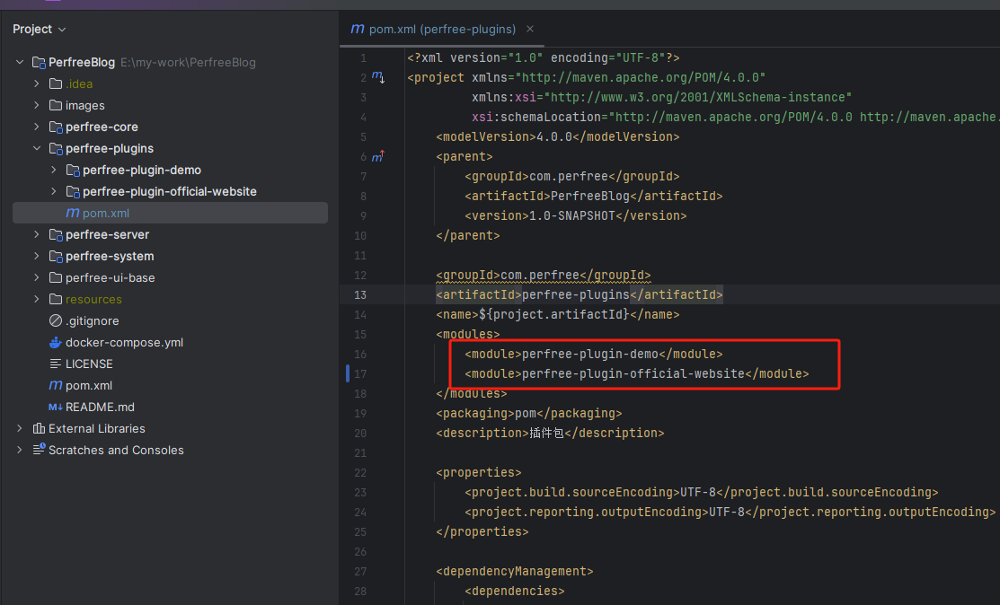

## 简介
该文档讲解了插件的创建及目录结构
## 创建插件
系统内置了插件快速创建工具类, 您可以在perfree-core包下找到com.perfree.plugin.CreatePlugin类, 如图

修改插件的信息, 运行即可, 运行完毕后会在perfree-plugins目录下生成插件基础代码

之后在perfree-plugins模块的pom文件中将该插件引入即可


## 目录结构
```bash
perfree-plugin-test # 插件目录
├── src # 后端源码目录
|   └── main # 预览图
|       └── java
|           └── 源码包目录
|       └── resources
|           └── sql # 插件sql文件
|               └── install.sql # 插件安装时执行的sql文件(程序会自动执行,无需插件处理)
|               └── uninstall.sql # 插件卸载时执行的sql文件(程序会自动执行,无需插件处理)
|           └── assembly.xml # 插件打包assembly配置
|           └── plugin.yaml # 插件信息
|           └── setting.json # 插件设置项
├── ui # 前端源码目录
|   └── src
|       └── core # 核心目录,里边存放了一些工具类
|       └── modules # 模块源码目录
|       └── router # 路由
|       └── App.vue # 入口
|       └── main.js # 入口
|   └── build.js # 打包脚本
|   └── index.html # 入口
|   └── jsconfig.json # js配置
|   └── package.json # 依赖管理
|   └── vite.config.js # vite配置
|   └── vite.module.config.js # 模块化前端打包配置
├── pom.xml # pom依赖管理
```

## 插件信息详解
在插件源码中,存在plugin.yaml插件信息文件,内容如下
```yaml
plugin:
    # 插件id(必须唯一)
    id: perfree-plugin-test
    # 插件名称,
    name: 测试插件
    # 插件mapperXml文件位置, 没有可不写
    mapperLocation: mapper/*.xml
    # 插件描述信息
    description: 测试插件
    # 插件最低支持版本
    minimalVersion: 4.0.0
    # 插件版本
    version: 1.0.0
    # 插件静态资源路径
    staticLocations: /ui/
    # 是否为开发环境(如果是插件前端通过node运行,需要开启dev且设置前端开发环境地址)
    isDev: true
    # 前端开发环境地址
    frontDevAddress: http://127.0.0.1:4202
    # 插件更新url
    updateUrl:
author:
    # 作者名
    name: perfree
    # 作者邮箱
    email: perfree@126.com
    # 作者网站
    webSite: https://yinpengfei.com
```