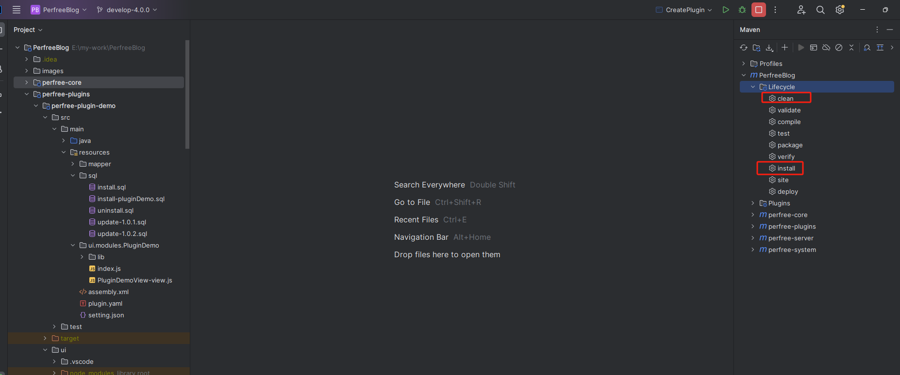
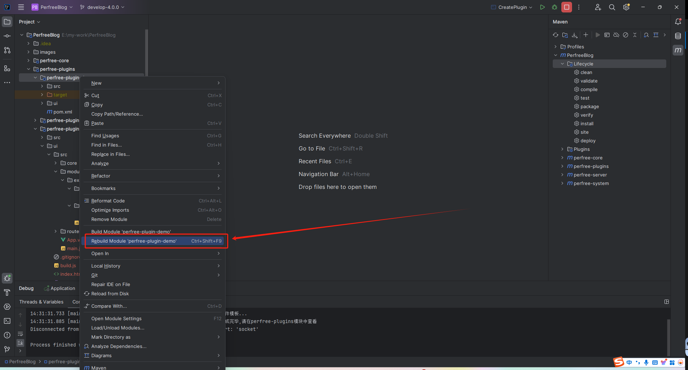

## 后端开发须知
- 如果为开发环境, 您需要将plugin.yaml配置信息中的plugin.isDev修改为true, plugin.frontDevAddress修改为插件ui前端的实际地址
- 插件创建完毕后请先执行maven clean及maven install

- 插件源码有改动会自动加载, 无需重启程序, 您只需在每次修改完后在插件目录右键, rebuild下即可, 如下图

- 如您插件新增了第三方依赖, 请先停止程序, 执行maven clean及maven install后再启动程序