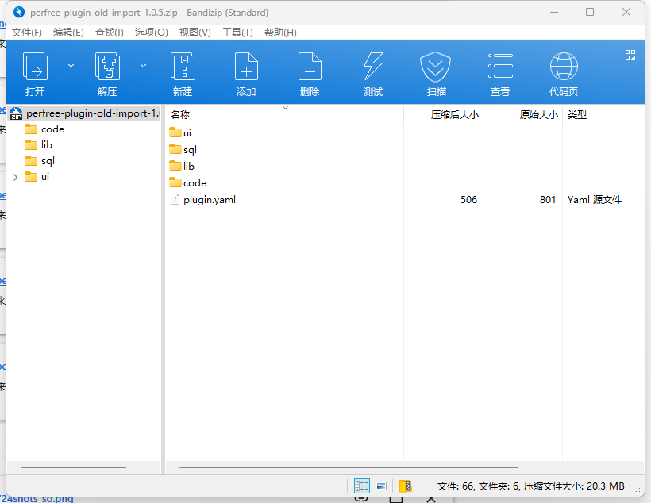

## 简介
插件打包时,您需要先打包前端,之后再打包后端,确保前端输出的文件在插件目录src/main/resources/ui下

## 前端打包
```bash
npm run build
```
执行完毕后会自动将打包后的文件输出至插件目录src/main/resources/ui下

## 后端打包
```bash
maven package
```
打包后会在target目录生成zip文件, zip文件结构如图所示, 之后就可以在主程序内安装此zip使用了
