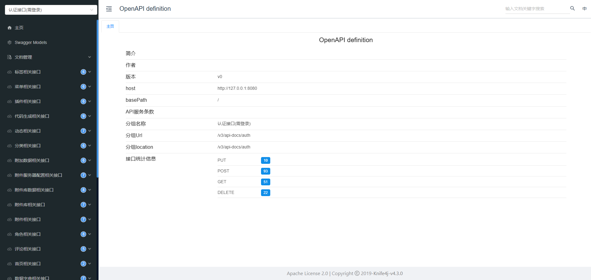
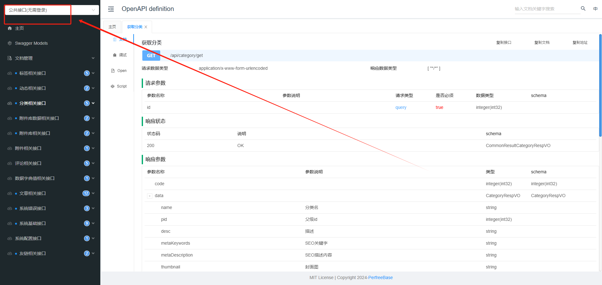

## 简介
在开发主题时, 除了使用模板指令外, 您还可以调用api接口来实现功能, 而且api接口会更加灵活~
## api接口文档
修改系统配置文件中的knife4j.enable打开接口文档
```yaml
# knife4j的增强配置
knife4j:
  enable: true
```
修改后重启系统, 访问ip:端口/doc.html,即可看到接口文档页面


找到公共接口,按需调用即可
