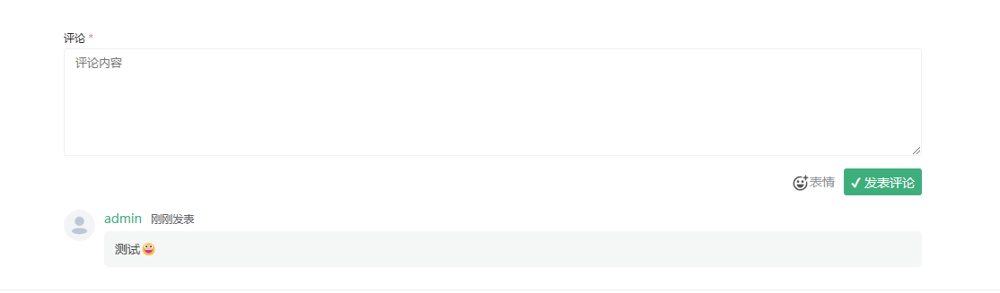

## 简介
我们提供了独立的评论插件供主题使用,地址[https://github.com/PerfreeBlog/perfree-comment](https://github.com/PerfreeBlog/perfree-comment)
## 使用方法
1. 下载最新的[releases](https://github.com/PerfreeBlog/perfree-comment/releases)包
2. 将其解压放至主题静态资源目录内, 比如/static/libs/perfree-comment
3. 引入评论插件
```html
<link href="/static/themes/主题目录/static/libs/perfree-comment/perfree-comment.css" rel="stylesheet">
<script src="/static/themes/主题目录/static/libs/perfree-comment/perfree-comment.js"></script>
```
4. 在文章页/自定义页面/动态页的每一条动态中可采用以下方式展示评论插件
```html
<perfree-comment article-id="#(article.id)" show-comment-list="true" class="perfree-comment"></perfree-comment>
```
其中article-id为文章的id, show-comment-list为是否展示文章列表

最终效果如下
