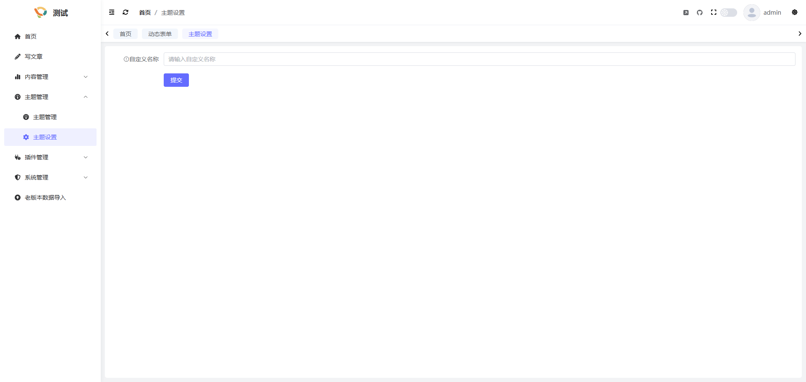

## 简介
主题支持拥有自己的设置项, 比如系统自带的Default主题,就拥有以下设置项


其实这些设置项都是通过动态表单生成的, 存放于主题目录下的setting.json文件中, 以下内容会让您了解如何生成主题设置项
## 动态表单
在系统后台管理中,打开系统管理-> 系统工具 -> 动态表单, 您会看到如下界面


左侧为支持的组件, 中间为工作区, 右侧为信息配置区, 这里以输入框为例, 拖拽一个输入框到工作区

点击这个输入框, 您会看到右侧有字段ID/字段名称/提示信息等配置项, 其中字段ID就是我们以后要使用这项信息的KEY, 这里给它改成WEB_CUSTOM_NAME


之后我们可以点击"生成JSON", 将生成出来的JSON信息复制粘贴进主题的setting.json文件中


这个时候再打开主题设置页, 就可以看到我们提供的设置项了


## 获取主题自定义设置项
在获取主题自定义设置项时, 可通过#option获取,使用方式如下
```
#option('WEB_CUSTOM_NAME',"theme_Default", '默认值')
```
参数解释: 第一个参数即为动态表单的字段ID, 第二个参数为theme_加上当前主题名(与主题theme.yaml中的name保持一致), 第三个参数为默认值(当获取的设置项为空时,会默认展示该值)

## 修改或新增设置项
后续如果需要修改或新增设置项,我们只需要将主题内的setting.json文件中的内容复制,在动态表单中点击导入json, 将复制的内容粘贴即可二次编辑设置项