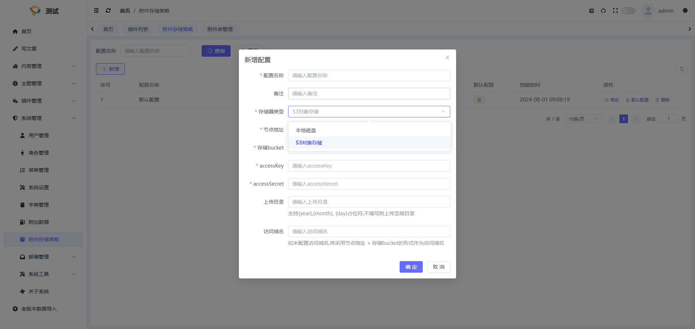
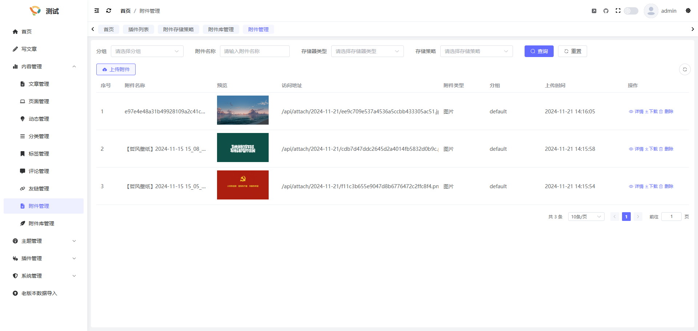
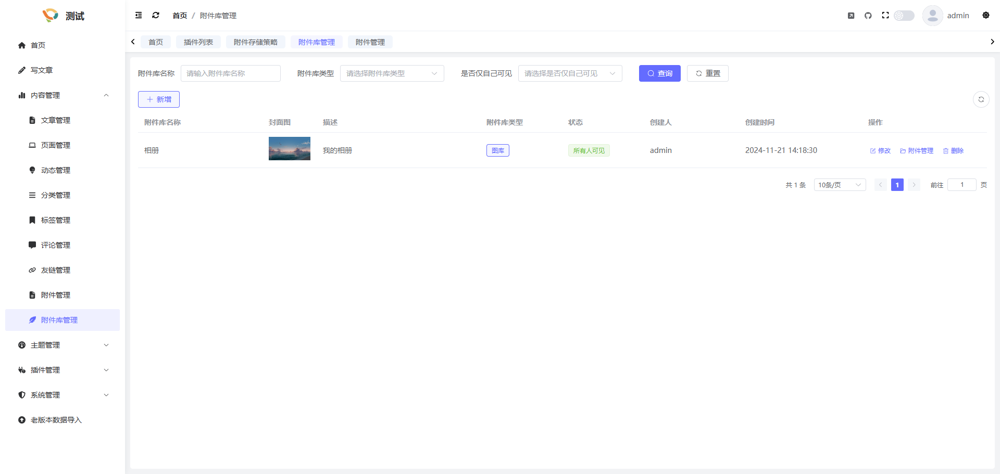
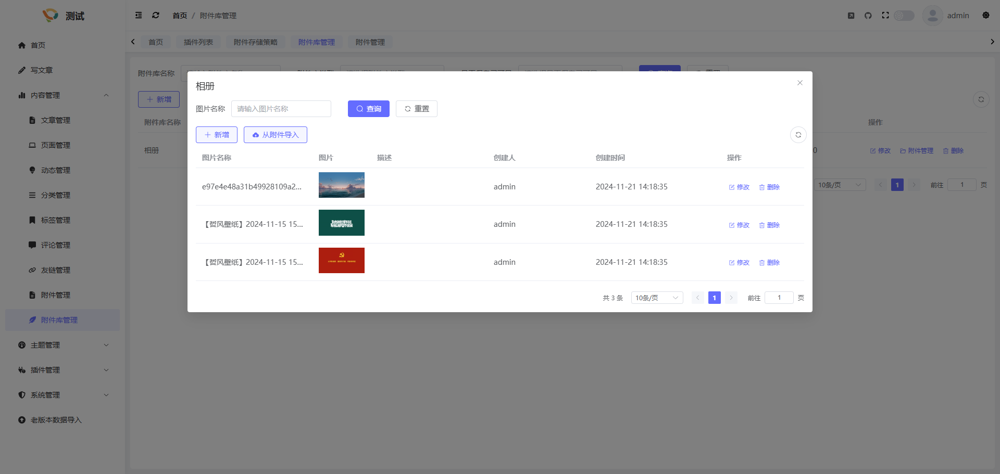

## 简介
附件部分分为附件存储策略、附件管理以及附件库管理三部分, 附件存储策略定义了附件的上传方式/存储方式; 附件管理为已上传的附件管理功能; 附件库管理可以理解为多个附件组成一个附件库, 利用该功能您可以定义如相册, 视频库, 音乐库等

## 附件存储策略
在系统管理->附件存储策略中, 展示了当前系统拥有的附件存储策略, 安装后默认会自带一个本地磁盘的存储策略,存储位置为resources/upload, 您也可以定义更多的存储策略,来实现自己的附件存储方式,点击新建存储策略进行创建即可, 您可以将存储器类型定义为本地存储或S3存储, S3存储支持市面上大部分OSS存储及S3文件存储服务器

创建完存储策略后,您可以在上传文件时选择新建的存储策略, 就可以将文件按照当前存储策略进行存储了, 当然您也可以将此存储策略设置为默认存储, 之后上传文件默认走的就是该存储策略

## 附件管理
在内容管理-> 附件管理中, 您可以对已上传的文件进行删除、修改、下载、查看详情等操作, 同时您也可以在此页面进行附件的上传

## 附件库管理
在内容管理-> 附件库管理中, 您可以自定义创建附件库, 如相册、视频库等,就可以在前台界面进行展示(需主题支持)

