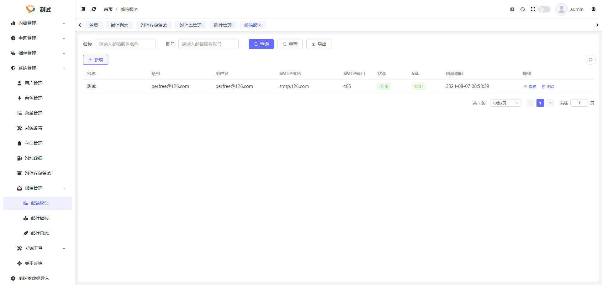
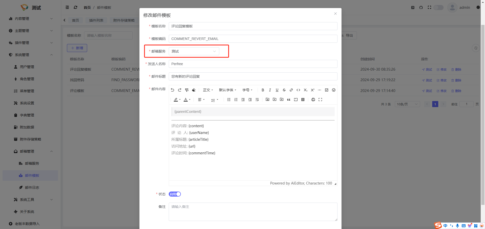

## 简介
在系统中, 找回密码、评论邮件提醒等功能都依赖于邮箱服务, 您可以在系统管理->邮箱管理功能中进行邮箱服务的配置, 同时也可以进行邮件模板的配置以及邮件日志的查看

## 邮箱服务
在邮箱服务中,您可以配置您的邮箱服务器信息, 如网易126邮箱、QQ邮箱等, 注意需要邮箱服务开启SMTP邮件代发授权, 如何开启可进行搜索"xxx邮箱开启SMTP", 之后修改或创建邮箱服务即可

## 邮件模板
系统中找回密码、收到回复、收到评论这些功能的邮件信息都是有邮件模板定义出来的,您可以在此修改模板的内容,来自定义您的邮件提醒样式, 但是要注意邮件模板是和邮箱服务关联的,应确保邮箱服务可用

## 邮件日志

在这里您可以看到您的所有邮件发送记录