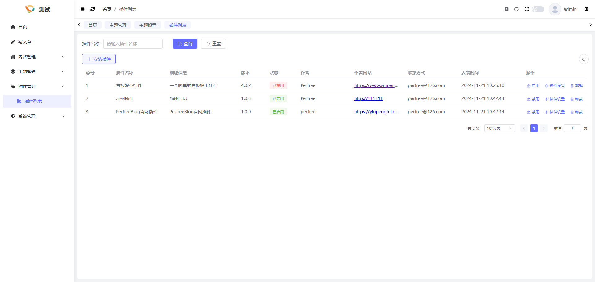
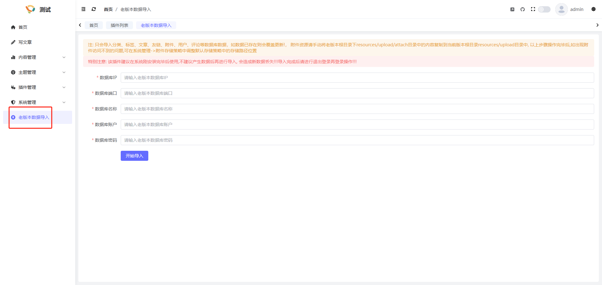

## 简介
系统拥有强大的扩展插件功能, 您可以在插件管理进行插件的管理操作

## 插件安装
您可以在官网-插件仓库中下载您喜欢的插件,之后点击"安装插件", 将下载好的插件文件上传即可

> 注意安装后的插件并非直接启用的,需要手动启用使其生效

## 插件启用/禁用
插件的启用/禁用按钮可控制插件是否应用

## 插件卸载
卸载插件前需先将插件禁用,之后点击卸载即可

## 插件更新
插件更新操作同样是直接安装即可, 会覆盖更新

## 插件设置
每个插件拥有独立的设置页面, 您可以点击插件设置进行查看

## 插件独立页面
插件可以在后台管理界面拥有独立的界面, 取决于插件是否创建了菜单,如"老版本数据导入"插件, 启用后会在后台创建"老版本数据导入"菜单
