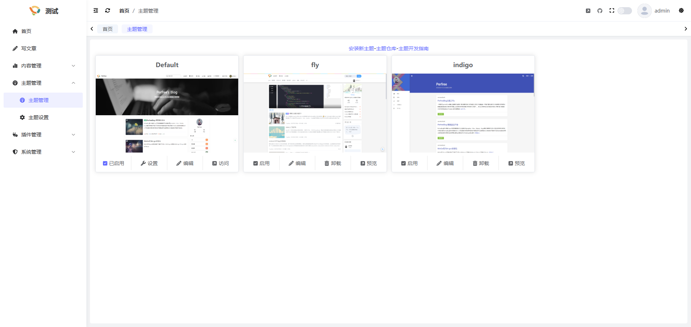
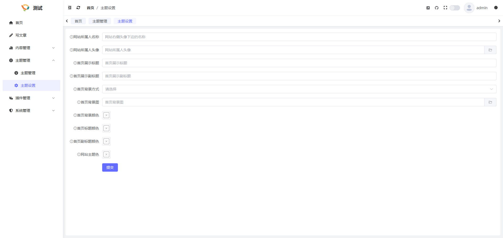

## 简介
系统拥有完善的主题系统,您可以在后台管理-主题管理中进行主题的管理

## 主题安装
您可以在官网-主题仓库中下载您喜欢的主题,之后点击"安装新主题", 将下载好的主题文件上传即可, 安装后点击启用即可将网站切换为新的主题

## 主题卸载
点击"卸载"即可卸载主题

> 注意: 卸载会删除主题文件, 如有自己改动的内容,请提前备份

## 主题更新
下载新版本的主题, 点击安装即可,主题更新时会覆盖原主题, 如您在原主题做了自定义修改, 请提前备份

## 主题设置
每个主题都可以自定义自己的设置项, 您可以点击主题设置, 进行当前主题的自定义设置
